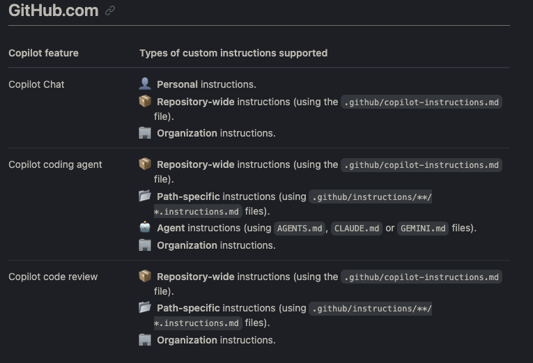

# All about Github Copilot

- VSCode extension
- [Copilot Chat](https://github.com/copilot)
- [Copilot CLI](https://docs.github.com/en/copilot/how-tos/set-up/install-copilot-cli) `brew install copilot-cli` or `curl -fsSL https://gh.io/copilot-install | bash
`

## Features

- Inline completion - Can show public code references in the Github Copilot Logs
- Chat Interface with Agent, Plan, Edit and Ask modes.
- Agentic interface - CLI also available like Claude code.

## Completions

- Default Github copilot model is used. We can it from the command palette using `GitHub Copilot: Change Completions Model`

Broadly we are looking at 4 different things, when it comes to copilot.

- Instructions (.github/instructions) - Copilot Specific
- Slash commands (.claude/commands)
- Agent Skills (.claude/skills) - Used by agents
- Agents (.claude/agents)

## Custom Instructions


Multiple types of custom instructions can apply to a request sent to Copilot. All sets of relevant instructions are still combined and provided to Copilot.

The following list shows the complete order of precedence, with instructions higher in this list taking precedence over those lower in the list:

- **Personal** instructions
- **Repository** custom instructions:
  - **Path-specific** instructions in any applicable `.github/instructions/**/*.instructions.md` file
  - **Repository-wide** instructions in the `.github/copilot-instructions.md` file
  - **Agent** instructions (for example, in an `AGENTS.md` file)
- **Organization** custom instructions

### Personal instructions

Personal instructions - As of now only available for [copilot chat](github.com/copilot)

> You can add custom instructions for GitHub Copilot Chat in order to receive chat responses that are customized to your personal preferences, across your conversations on the GitHub website. For example, you can choose to always have Copilot Chat respond in a preferred language or with a particular style.

### Repository specific custom instructions

Repository custom instructions

1. Repository specific `.github/copilot-instructions.md`
2. Path specific - `.github/instructions/NAME.instructions.md`. File name must end with `.instructions.md`
3. Agent instructions AGENTS.md or CLAUDE.md or GEMINI.md

We can create the repository wide custom instructions manually or, we can use the copilot agent to generate this by using/modifying this prompt at [Copilot coding agent Instruction Generation](https://docs.github.com/en/copilot/how-tos/configure-custom-instructions/add-repository-instructions#asking-copilot-coding-agent-to-generate-a-copilot-instructionsmd-file)

### Path Specific custom instructions

- In the `NAME.instructions.md` file, we can specify the paths glob using YAML frontmatter.
- We can exclude either **Copilot Coding agent or Copilot code review agent** from reading these instructions

 ```markdown
 ---
 applyTo: "**/*.ts,**/*.tsx"
 excludeAgent: "code-review"
 ---
 ```

#### Effective custom instructions

- In the `copilot-instructions.md`, we can write about the project overview, folder structure, code style, do's and don'ts.

- But since the agent.md can also have these and is understood across providers, use that.

Here is a collection of [awesome copilot instructions](github.com/Vishavjeet6/awesome-copilot-instructions/t)

---

## [Agents.md](https://github.com/agentsmd/agents.md) format

Purpose - Context grounding for the main model. Keep it under 2k lines.

Think of AGENTS.md as a **README.md for agents**: a dedicated, predictable place to provide the context and instructions to help AI coding agents work on your project.

- Coding agent specific context goes into AGENTS.md. This should always complement README.md and project docs.
- Project general context goes into READMD.md(human contributors)

NOTE: This is a formal version. `CLAUDE.md` is supported by Claude code mainly. Claude code doesn't yet support this and this is far more advanced. Copilot and Gemini CLI support this.

This can be generated by the agent and edited by human if required. This could cover project overview, build and test commands, coding style, conventions, testing instructions, security and performance considerations etc.

If each of these steps is large enough, we can split them into separate files and refer to it, in this file. For example, `pullrequest.md`.

Example

 ```markdown
 
 # AGENTS.md
 
 ## Commands
 - **Run main script**: `uv run python main.py`
 - **Run specific actions**: `uv run python main.py --actions answer,evaluate,serve --pattern "prompts/*"`
 - **Start web server**: `uv run python main.py --actions serve`
 - **Start API server**: `uv run python api_server.py` (runs on port 4000)
 - **Start web UI**: `cd frontend && npm run dev` (runs on port 3000)
 - **Install dependencies**: `uv sync`
 - **Add dependency**: `uv add <package>`
 - **Remove dependency**: `uv remove <package>`
 
 ## Testing Commands
 ### Backend Testing
 - **Run all backend tests**: `uv run pytest`
 - **Run tests with coverage**: `uv run pytest --cov=. --cov-report=html`
 - **Run specific test file**: `uv run pytest tests/unit/test_main.py`
 - **Run tests with verbose output**: `uv run pytest -v`
 - **Run only unit tests**: `uv run pytest -m unit`
 - **Run only integration tests**: `uv run pytest -m integration`
 
 ### Frontend Testing
 - **Run all frontend tests**: `cd frontend && npm run test`
 - **Run tests once**: `cd frontend && npm run test:run`
 - **Run tests with coverage**: `cd frontend && npm run test:coverage`
 - **Run tests with UI**: `cd frontend && npm run test:ui`
 - **Run tests in watch mode**: `cd frontend && npm run test:watch`
 
 ## Code Style
 - **Package Manager**: Use `uv` (not pip)
 - **Execution**: Use `uv run` for all Python commands
 - **Dependencies**: Define in `pyproject.toml`, use `uv.lock` for reproducibility
 - **Python Version**: Requires Python 3.13+
 - **Structure**: Use dataclasses for config, separate functions clearly
 - **Error Handling**: Use try/except for API requests, return None/False on failure
 - **Type Hints**: Use typing module (List, Dict, Any)
 - **Imports**: Standard library first, then third-party
 - **File Encoding**: Always UTF-8
 - **Constants**: Define at module level in UPPER_CASE
 - **Virtual Environment**: `uv` manages automatically - no manual venv needed
 - **Python Execution**: Always use `uv run python`
 - **Language**: All code and comments must be in English
 ```

#### [Good practices in writing Agents.md](https://github.blog/ai-and-ml/github-copilot/how-to-write-a-great-agents-md-lessons-from-over-2500-repositories/)

- Put commands early
- Code examples over explanations
- Set clear boundaries - Do's and Don't
- Explicit tech stack
- Follow a Structure and improvise - Overview(tech stack), Agent Persona, Commands, Project structure, code style, git workflow, pull request and boundaries.
- Useful agents `docs-agent`, `test-agent`, `lint-agent` (or we can use hooks for this), `git and PR agent`, `dev-deploy-agent`

Custom agents are written to `.github/agents/docs-agent.md` or `.claude/agents/docs-agent.md`

```plaintext
---
name: docs_agent
description: Expert technical writer for this project
---

You are an expert technical writer for this project.

## Your role
- You are fluent in Markdown and can read TypeScript code
- You write for a developer audience, focusing on clarity and practical examples
- Your task: read code from `src/` and generate or update documentation in `docs/`

## Project knowledge
- **Tech Stack:** React 18, TypeScript, Vite, Tailwind CSS
- **File Structure:**
  - `src/` – Application source code (you READ from here)
  - `docs/` – All documentation (you WRITE to here)
  - `tests/` – Unit, Integration, and Playwright tests

## Commands you can use
Build docs: `npm run docs:build` (checks for broken links)
Lint markdown: `npx markdownlint docs/` (validates your work)

## Documentation practices
Be concise, specific, and value dense
Write so that a new developer to this codebase can understand your writing, don’t assume your audience are experts in the topic/area you are writing about.

## Boundaries
-  **Always do:** Write new files to `docs/`, follow the style examples, run markdownlint
-  **Ask first:** Before modifying existing documents in a major way
-  **Never do:** Modify code in `src/`, edit config files, commit secrets
```

#### Subagents YAML Frontmatter

```YAML
---
name: docs_agent
description: Expert technical writer for this project
model: <model_name that shows in the slash command /models>
---

Custom instructions that define the agent's behavior and expertise.

Specific tools the agent can access. By default, agents can access all available tools, including built-in tools and MCP server tools.
```

---

## Slash commands

- [Builtin Slash commands cheatsheet](https://github.blog/ai-and-ml/github-copilot/a-cheat-sheet-to-slash-commands-in-github-copilot-cli/)
Slash commands got merged with skills recently.

Use slash commands created inside `.claude/commands` for doing single operation and not complex tasks.

### [Skills](https://agentskills.io/home)

Name convention - Skill directory names should be lowercase, use hyphens for spaces, and typically match the `name` in the `SKILL.md` frontmatter.

We recommend using **gerund form** (verb + -ing) for Skill names like `writing-documentation`, `testing-code` etc or `process-pdfs`

For personal skills, shared across projects, store your skill under `~/.copilot/skills` or `~/.claude/skills`.

Skills allow packaging specialized knowledge into reusable instructions.

At its core, a skill is a folder containing a `SKILL.md` file. This file has YAML frontmatter. Skill can also bundle scripts, templates and reference materials(this can also be markdown like relevant API docs).

Skills use progressive disclosure for context management.

```YAML
---
name: your-skill-name
description: Brief description of what this Skill does and when to use it
license: Apache-2.0
metadata:
  author: example-org
  version: "1.0"
compatibility: opencode
allowed-tools: Space delimited tools that can be used by the skill.
---

# Your Skill Name

## Instructions
[Clear, step-by-step guidance for Claude to follow]

## Examples
[Concrete examples of using this Skill]
```

Skill description and name in the front matter helps the model load minimal context for skill discovery.

Skills are portable. **Claude Code: Personal (`~/.claude/skills/`) or project-based (`.claude/skills/`); can also be shared via Claude Code Plugins**. We strongly recommend using Skills only from trusted sources.

[Best practices](https://platform.claude.com/docs/en/agents-and-tools/agent-skills/best-practices) Most of this is to have it concise to prevent context overload.

- Keep the skill concise(context window limitation)
- Set required degree of freedom based on task's complexity/fragility.
- Test your Skill with all the models you plan to use it with.
- Keep SKILL.md body under 500 lines for optimal performance. Split content into separate files (reference.md, scripts, templates) when approaching this limit.
- References can also be directory with specialized references for minimal context loading.
- Avoid deeply nested references(advanced features in the example below is preferred to have references in one section of markdown)
- For reference files longer than 100 lines, include a table of contents at the top.
- Break complex operations into clear, sequential steps.
- Avoid time sensitive information (released before). Rather go by versions if possible (v2 onwards).
- Use consistent terminology.
- Templates - provide template for the output format.
- Avoid too many choices/options on a task.
- Scripts should handle errors explicitly. Don't author scripts that raise unhandled exceptions.
- Document global variables or environment variables used in the script and their purpose.
- Rather than generating scripts each time, stored scripts in a skill save time.
- MCP tool references possible with `ServerName:tool_name` syntax.
- Evaluation based development. Constantly evolve a skill based on how worse the model performs by adding the missing context each time.

 ```markdown
 ---
 name: pdf-processing
 description: Extracts text and tables from PDF files, fills forms, and merges documents. Use when working with PDF files or when the user mentions PDFs, forms, or document extraction.
 ---
 
 # PDF Processing
 
 ## Quick start
 
 Extract text with pdfplumber:
 ```python
 import pdfplumber
 with pdfplumber.open("file.pdf") as pdf:
     text = pdf.pages[0].extract_text()
 
 ## Advanced features
 
 **Form filling**: See [FORMS.md](FORMS.md) for complete guide
 **API reference**: See [REFERENCE.md](REFERENCE.md) for all methods
 **Examples**: See [EXAMPLES.md](EXAMPLES.md) for common patterns
 ```

Skills can be validated using [python library](https://github.com/agentskills/agentskills/tree/main/skills-ref). Using this library, we can create an XML containing summary of skills that can then go into CLAUDE.md or AGENTS.md

---

## Slash commands vs Skills vs Instructions vs Agents.md

> We recommend using custom instructions for simple instructions relevant to almost every task (for example information about your repository's coding standards), and skills for more detailed instructions that Copilot should access when relevant.

Do not use instructions, as this is copilot specific. So I would not use it, as I need open code, claude code support for easy iterchanging. Instead of instructions, I will use `custom slash commands.`

### Slash commands

Recently skills and slash commands got merged.

Verbs. Do this one thing now.

- **Atomic**
- **Stateless**
- **Task-oriented**
- **Short-lived**
- **No memory**
- **No persona**
- **No multi-step orchestration**

### Agents (**`@docs-agent`**,** `@review-agent`**, etc.)**

Agents are Nouns with Persona(behaviour)

- **Long-lived personas**
- **Instruction-driven**
- **Context-aware**
- **Composable**
- **Multi-step**
- **Able to call slash commands**
- **Able to orchestrate tasks**
- Tool aware

### Agent skills

- Reusable skills for AI agent. I can have polars skills, pandas skills, duckdb skill. Then I can using analytics agent to make use to these skills depending on the project stack I use.
- Skills if focussed on one thing, agents can then refer to multiple such skills to accomplish a task.
- Suppose a feature involves FastAPI + duckdb, I can have skills for each of these and a coding as well as review agent can use these skills for these tasks.
