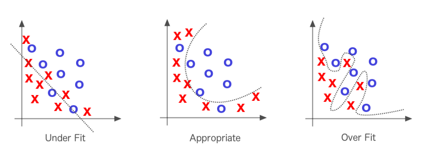
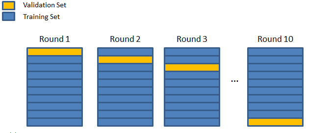
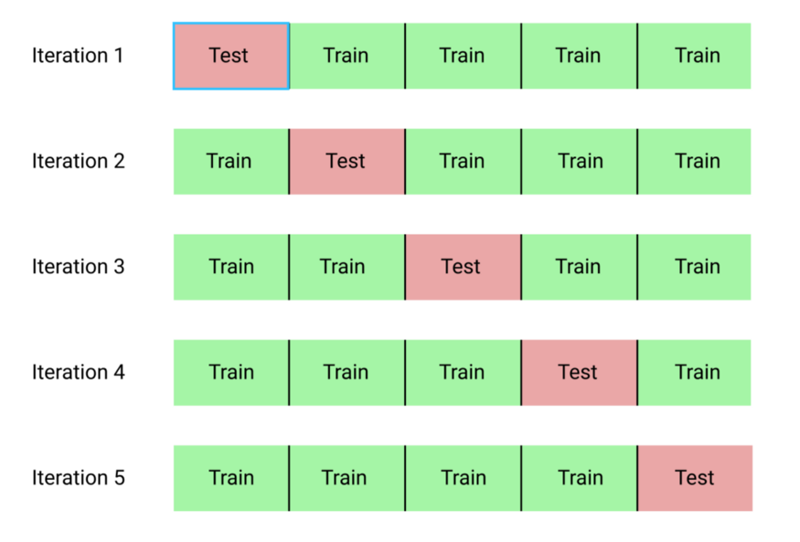
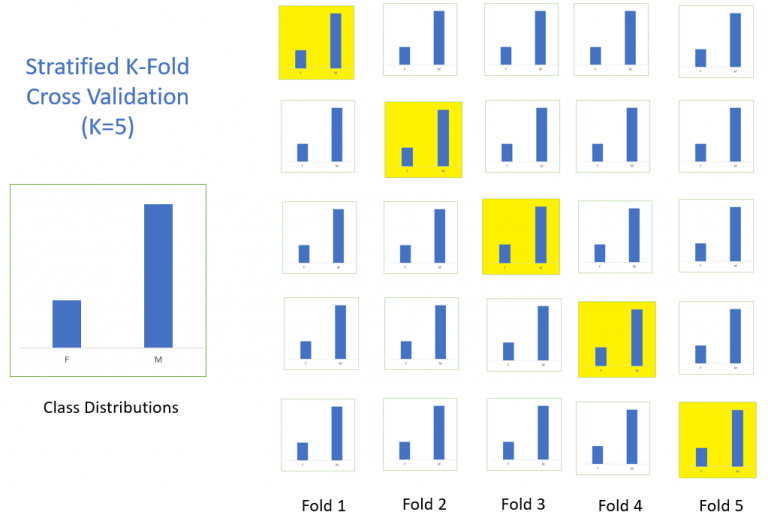
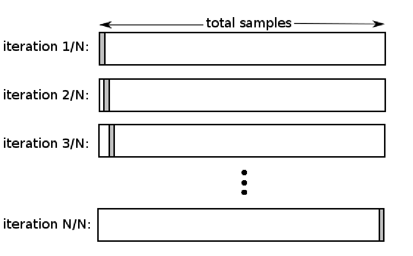

# Cross validation

## Overfitting and Underfitting

## Steps involved in cross validation

* Partition the training data in to a K number of subsets/groups/folds called as validation sets.
* Hold out a set at a time and train the model on the remaining set
* Test the model on the hold out validation set.
* Mean of the evaluation scores on all the validation sets are taken and returned as the model performance.
* It is also good practice to include a measure of the variance of the skill scores, such as the standard deviation or standard error.

> Each observation in the data sample is assigned to an individual group and stays in that group for the duration of the procedure. This means that each sample is given the opportunity to be used in the hold out set 1 time and used to train the model k-1 times.

## Types of cross validation

* K-fold cross validation
* Stratified K-fold cross validation
* Leave One Out Cross Validation (LOOCV)
* Repeated K-fold cross validation
* Nested K-fold cross validation

### K-fold cross validation

* In statistics, relate this to `simple random sample`
* Value of K - refers to the number of groups the training set will be split into. If k=5, then the entire training set will be split into 5 subsets.
* In each iteration, one of the subset will be held out and the model will be trained on the remaining subsets as the training set.
* Model will then be evaluated on the hold out validation set.
* Evaluation score is noted down and the model is discarded.

* The value for `k` is chosen such that each train/test group of data samples is large enough to be a representative sample of the population.

> A value of **`k=10`** is very common in the field of applied machine learning, and is recommend if you are struggling to choose a value for your dataset.

* It is preferable to choose the value of K that will evenly split the training set in to K subsets.

### Stratified K-fold cross validation

* In statistics, relate this to `stratified random sample`.

> The splitting of data into folds may be governed by criteria such as ensuring that each fold has the same proportion of observations with a given categorical value, such as the class outcome value. This is called stratified cross-validation.

### Leave out one cross validation(LOOCV)

> k=n: The value for k is fixed to n, where n is the size of the dataset to give each test sample an opportunity to be used in the hold out dataset. This approach is called leave-one-out cross-validation.

* If there are n training samples, then the model is trained on n-1 samples and the one held out is used for validation.
* In each iteration `i`, `i`th training sample is held out. The number of iterations is equal to the number of data points(training samples) `n`.

### Repeated K-fold cross validation

K-fold cross validation procedure is repeated `n` times. Each time the entire training set is shuffled, so that we get a different data split on every repetition.

### Nested K-fold cross validation

> This is where k-fold cross-validation is performed within each fold of cross-validation, often to **perform hyperparameter tuning** during model evaluation.

This is also known as double cross validation.

## References

* [Cross validation explained](https://towardsdatascience.com/cross-validation-explained-evaluating-estimator-performance-e51e5430ff85)

* [A Gentle Introduction to k-fold Cross-Validation](https://machinelearningmastery.com/k-fold-cross-validation/)

* [How to Configure k-Fold Cross-Validation](https://machinelearningmastery.com/how-to-configure-k-fold-cross-validation/)

* [How to Fix k-Fold Cross-Validation for Imbalanced Classification](https://machinelearningmastery.com/cross-validation-for-imbalanced-classification/)
