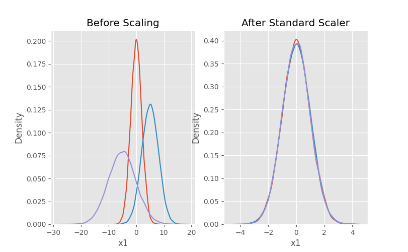

# Feature Scaling



## Why feature scaling

* In a machine learning dataset, not all the numerical features will be on the same scale.

* Some machine learning algorithms that are distance based will be affected by numerical features with different scales. The feature with larger scale tends to dominate other numerical features with smaller scales.

* For gradient descent based algorithms like linear regression, logistic regression, feature scaling ensures quick convergence towards the minima.

## Feature Scaling techniques

Commonly used feature scaling techniques are

* Normalization
* Standardization

## Normalization

Converts the numerical values of any scale to values in the range `[0, 1]`.

```Text
x' = x - x_min/(x_max - x_min)
```

## Standardization

Convert the values to follow standard normal distribution (z-distribution) with a mean of 0 and standard deviation of 1.

```Text
# same formula for calculating the z-score
x' = (x - mean)/ std
```

## Normalization vs Standardization

* Use normalization, when the distribution of the  numerical feature values do not follow **Normal(Gaussian) distribution**.

* Standardization can be helpful in cases where the data follows a Gaussian distribution.

## Visualizing the effect of feature scaling

```Python
# %%
import matplotlib
import matplotlib.pyplot as plt
import numpy as np
import pandas as pd
import seaborn as sns
from sklearn import preprocessing
%matplotlib inline
matplotlib.style.use("ggplot")

# %%
rng = np.random.default_rng(seed=1)
df = pd.DataFrame(
    {
        "x1": rng.normal(0, 2, 10000),
        "x2": rng.normal(5, 3, 10000),
        "x3": rng.normal(-5, 5, 10000),
    }
)

# %%
scaler = preprocessing.StandardScaler()
scaled_df = scaler.fit_transform(df)
scaled_df = pd.DataFrame(scaled_df, columns=["x1", "x2", "x3"])

# %%
fig, (ax1, ax2) = plt.subplots(ncols=2, figsize=(6, 5))

ax1.set_title("Before Scaling")
sns.kdeplot(df["x1"], ax=ax1)
sns.kdeplot(df["x2"], ax=ax1)
sns.kdeplot(df["x3"], ax=ax1)

ax2.set_title("After Standard Scaler")
sns.kdeplot(scaled_df["x1"], ax=ax2)
sns.kdeplot(scaled_df["x2"], ax=ax2)
sns.kdeplot(scaled_df["x3"], ax=ax2)
plt.show()
```

---

## References

* [Feature Scaling for Machine Learning](https://www.analyticsvidhya.com/blog/2020/04/feature-scaling-machine-learning-normalization-standardization/)

* [All about feature scaling](https://towardsdatascience.com/all-about-feature-scaling-bcc0ad75cb35)

* [All about feature scaling and normalization](https://sebastianraschka.com/Articles/2014_about_feature_scaling.html)
