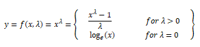

# Preprocessing numerical features

* Numerical values can represent measurements or counts. It can be either an integer or a floating point number.

* Numerical data can be transformed to represent new features in several ways.

## Binarization

* `Binarizer(threshold)` - assigns 1 if `feature_value > threshold`, otherwise assigns 0.

```Python
from sklearn.preprocessing import Binarizer
```

## Rounding off

* Numerical features with higher precision can be rounded off to lower precision or to some discrete values.

* Rounding off could be used to implement binning(another feature engineering technique)

## Interactions

* Here new features are created by multiplying input features.

* `PolynomialFeatures` can be used to create features that are interactions of two other features.

```Python
from sklearn.preprocessing import PolynomialFeatures
import numpy as np

# some input with three features. Let's call these input features as a, b and c
arr = np.arange(1, 7).reshape(2, 3)

# When interactions only, if degree is 2, only atmost 2 input features will be 
# multiplied at a time to create new features
pf = PolynomialFeatures(degree=2, interaction_only=True, include_bias=False)
arr_trans = pf.fit_transform(arr)

# this will contain new features produced by a*b, b*c and c*a
# same can be confirmed by inspecting the pf.powers_ attribute
arr_trans
pf.powers_
```

* If `degree=3`, then atmost 3 features will be multiplied to create a new feature. In the output matrix, we will have input features, new features formed by multiplying 2 input features at a time (nC2), then new features formed by multiplying 3 input features at a time (nC3).

## Binning (aka Discretization)

* Very similar to histogram plot where the numerical data is put into various bins(intervals)
* In other words, we would convert a continous numerical feature to a feature with discrete values (that can be treated like a categorical variable).
* The following approaches are unsupervised binning techniques.
  * Fixed-width binning
  * Custom width binning(based on the developer's instinct/observation of the data)
  * Adaptive binning

* **Entropy based binning** comes under supervised binning. Here target variable is used for selecting the cut points.

### Fixed-width binning

* Here the intervals are decided based on **domain knowledge or some rules** irrespective of the values in the dataset. For instance, **glucose** feature in the **pima indians diabetes dataset** can be binned to categories/intervals like
  * `glucose < 140` - **normal**
  * `glucose >= 140 and glucose < 200` - **prediabetic**
  * `glucose >= 200` - diabetic

* `pandas.cut(dataframe/ndarray,bins, labels)` can be useful to create binned features. **bins** parameter hold the value ranges, while **labels** hold the category names(think of it as each bin is assigned a category).

### Adaptive binning

* Adaptive binning using quantiles is also known as equal frequency binning. Under each bins, we will end up with equal number of datapoints.

> Using fixed-width will not be effective if there are large gaps for the range of the numerical feature, then there will be many empty bins with no data. This problem can be solved by positioning the bins based on quantiles.

* Use a histogram plot to see the distribution of the values.

* Here the intervals are formed based on the distribution of the values in the dataset. Percentiles are used to form the intervals

> **Quantile based binning** is a good strategy to use for adaptive binning. Quantiles are specific values or cut-points which help in partitioning the continuous valued distribution of a specific numeric field into discrete contiguous bins or intervals. Thus, q-Quantiles help in partitioning a numeric attribute into q equal partitions. Popular examples of quantiles include the 2-Quantile known as the median which divides the data distribution into two equal bins, 4-Quantiles known as the quartiles which divide the data into 4 equal bins and 10-Quantiles also known as the deciles which create 10 equal width bins.

* `pandas.DataFrame.quantile(quantile_list)` can be used to get the values at the quantiles present in the **quantile_list**. This can now be used as the **bin** to pass to `pandas.cut` function.

* There is also a straightforward method `pandas.qcut(df/ndarray, q, labels)` to perform quantile based binning.

### Entropy based binning

> The entropy-based binning algorithm categorizes the continuous numerical variable such that majority of values in a bin(category) belong to the same target class label. It calculates entropy for target class labels, and it categorizes the split based on maximum information gain.

## Statistical transformations

Statistical transformation techniques like log transform, box-cox transform can be helpful in converting skewed data distributions to more gaussian/normal like distribution (family of power transform functions).

### Log transform

* `ln(feature)` or `log(feature)` - Either natural log (`base e`) or to the base 10.
* `numpy.log(1+feature)` - We add 1 to the feature value so as to avoid computing `log(0)` which is `-inf`.

* A histogram before and after the transformation would help observe the change of data distribution.

### Box-Cox transform

* 

* First for the given feature, we need to find the optimal `λ` value.
* The optimal value of `λ` is usually determined using a maximum likelihood or log-likelihood estimation
* `scipy.stats.boxcox` function can be used for performing this transformation.

```Python
from scipy.stats import boxcox

# first find the optimal lambda value
l, opt_lambda = boxcox(feature_vector)

# next perform the transformation
transformed_feature_vec = boxcox(feature_vector, lmbda=opt_lambda)
```

---

## References

* [Handling Continuous Numeric Data](https://towardsdatascience.com/understanding-feature-engineering-part-1-continuous-numeric-data-da4e47099a7b)
* [Binning](https://medium.com/hacktive-devs/feature-engineering-in-machine-learning-part-1-a3904769cd93)
* [Entropy based binning](https://github.com/paulbrodersen/entropy_based_binning)
