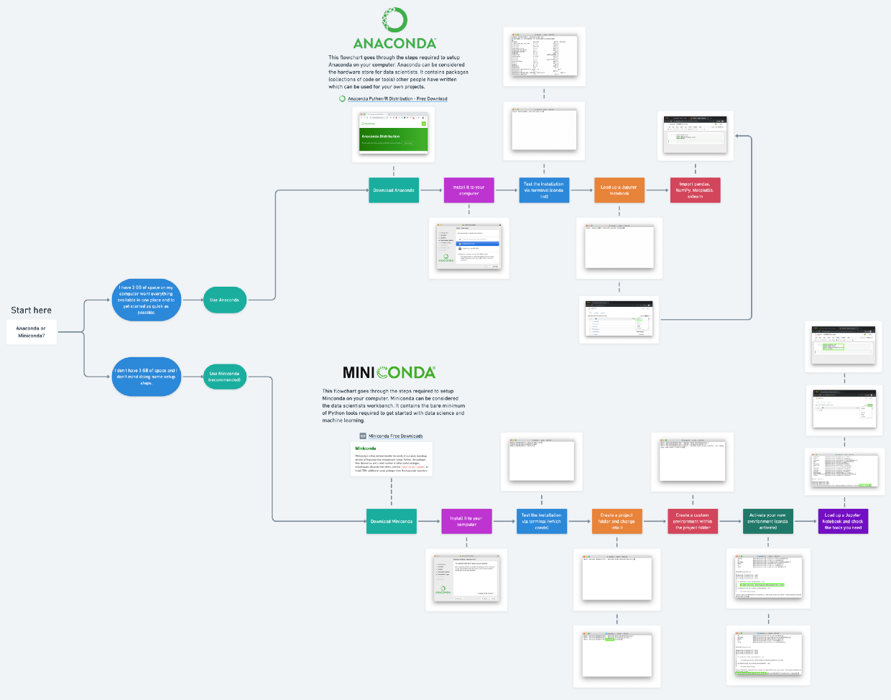

# Setting up development environment for ML

## Anaconda vs Miniconda vs Conda

* Anaconda - ships with over 150 packages. Occupies more storage.
* Miniconda - ships with handful of packages. It can be customised with required tools.
* conda- package manager used to manage packages in both Anaconda and Miniconda. It is similar to pipenv, pip etc

With Miniconda and conda, we can create an environment consisting of only required packages.

* 

## Anaconda installation using pyenv

* Since I use pyenv to install multiple python versions and environments,

```Bash
# This command list all anaconda versions available using pyenv
pyenv install --list | grep anaconda

# using the above command find the latest version
# and install using below command
pyenv install anaconda3-2019.10
```

## Miniconda installation using pyenv

```Bash
# This command list all miniconda versions available using pyenv
pyenv install --list | grep miniconda

# This will install latest miniconda for python3
pyenv install miniconda3-latest
```

## Important packages

* Jupyter notebooks - writing python code, running it and sharing work with others as notebooks.
* pandas - exploring and manipulating data
* Numpy - numerical operations on the data
* Matplotlib - visualization
* scikit-learn - building, analysing ML models

## Using pipenv to install packages

```Bash
pipenv install jupyter pandas matplotlib numpy scikit-learn
```

* Running jupyter notebooks using pipenv

```Bash
pipenv run jupyter notebook
```

* For the notebooks to run without any warning like **UserWarning: Could not import the lzma module. Your installed Python is incomplete. Attempting to use lzma compression will result in a RuntimeError.**, execute the following command `sudo apt-get install lzma lzma-dev`. But after this installation, we need to reinstall the python using pyenv.

---

## References

* [Get your computer ready for machine learning: How, what and why you should use Anaconda, Miniconda and Conda](https://towardsdatascience.com/get-your-computer-ready-for-machine-learning-how-what-and-why-you-should-use-anaconda-miniconda-d213444f36d6)

* [conda setup using pyenv](https://help.dreamhost.com/hc/en-us/articles/216137637-Pyenv-simple-Python-version-management)

* [Managing virtual environments with pyenv](https://towardsdatascience.com/managing-virtual-environment-with-pyenv-ae6f3fb835f8)

* [Pipenv vscode and jupyter notebooks](https://towardsdatascience.com/how-to-use-pipenv-with-jupyter-and-vscode-ae0e970df486)
